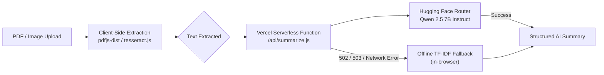

<div align="center">

# DocuSumm

### AI-Powered Document Intelligence

_A privacy-first web application that extracts document text entirely in the browser and generates structured, AI-driven summaries and insights._

<br/>

[](https://docusumm.vercel.app)
[](https://reactjs.org/)
[](https://vitejs.dev/)
[](https://tailwindcss.com/)
[](https://huggingface.co/)
[](#license)

<br/>

**[Live Demo](https://docusumm.vercel.app)** &nbsp;|&nbsp; **[Quick Start](#quick-start-local-development)** &nbsp;|&nbsp; **[Architecture](#architecture--tech-stack)** &nbsp;|&nbsp; **[Engineering Notes](#engineering-decisions--approach)**

</div>

<br/>

---

## Overview

**DocuSumm** is a full-stack web application that converts documents — PDFs or scanned images — into structured, actionable summaries. Text extraction is performed **entirely client-side**, so source files are never uploaded to a server; only the extracted text is sent to the AI layer for processing.

The system was designed with production reliability in mind: every UI state (empty, loading, error, success) is explicitly handled, the backend is secured behind a serverless proxy, and the application remains functional even if the AI provider is unavailable, thanks to a built-in offline fallback engine.

<br/>

## Key Features

<table>
<tr>
<td width="50%" valign="top">

**AI-Powered Analysis**
Summaries are generated using **Qwen 2.5 7B Instruct** (`Qwen/Qwen2.5-7B-Instruct:fastest`) via Hugging Face's OpenAI-compatible routing infrastructure.

**Dynamic Summarization**
Users can toggle between **Short**, **Medium**, and **Long** summary lengths. Token budgets are allocated dynamically to balance speed and rate-limit constraints.

**Structured Output**
In addition to summaries, the system extracts **Key Points** (with supporting explanations) and generates **Improvement Suggestions** covering tone, clarity, and content.

</td>
<td width="50%" valign="top">

**Client-Side Text Extraction**
Documents are parsed entirely in-browser using `pdfjs-dist` (PDF parsing) and `tesseract.js` (OCR via WebAssembly). Raw files never leave the user's device.

**Secured Backend**
A Vercel Serverless Function (`/api/summarize.js`) proxies all LLM requests, keeping the `HF_TOKEN` credential hidden from the client and mitigating abuse.

**Offline Fallback**
If the Hugging Face API is unreachable, rate-limited, or blocked by a firewall, the application automatically falls back to an on-device TF-IDF summarization algorithm.

</td>
</tr>
</table>

<br/>

## Architecture & Tech Stack



| Layer                | Technology        | Rationale                                                                     |
| :------------------- | :---------------- | :---------------------------------------------------------------------------- |
| **Frontend**         | React 18 + Vite   | Fast HMR-driven development and optimized production builds                   |
| **UI / Styling**     | Tailwind CSS      | Rapid, consistent, mobile-responsive design without heavy component libraries |
| **PDF Extraction**   | `pdfjs-dist`      | Industry-standard, accurate client-side PDF parsing                           |
| **Image Extraction** | `tesseract.js`    | In-browser OCR via WebAssembly, no external dependencies                      |
| **Backend**          | Vercel Serverless | Edge-optimized, zero-maintenance API routing                                  |
| **AI Provider**      | Hugging Face      | `router.huggingface.co` for fast, free-tier LLM inference                     |

<br/>

## Quick Start (Local Development)

### 1. Get a Hugging Face Token

1. Create a free account at [Hugging Face](https://huggingface.co/).
2. Go to **Settings → Access Tokens** and generate a new token.

### 2. Clone and Install

```bash
git clone <your-repo-url>
cd document-summary-assistant
npm install
```

### 3. Configure Environment Variables

Create a `.env.local` file in the project root (git-ignored, so credentials stay safe):

```env
HF_TOKEN=hf_your_actual_token_here
```

### 4. Run Locally

```bash
npm run dev
```

> **Note:** If no `.env.local` file is present, the backend automatically signals the frontend to use the offline TF-IDF fallback summarizer instead.

<br/>

## Vercel Deployment

| Step | Action                                                                                                    |
| :--: | :-------------------------------------------------------------------------------------------------------- |
|  1   | Push the local repository to GitHub                                                                       |
|  2   | Log into [Vercel](https://vercel.com/) and select **Add New → Project**                                   |
|  3   | Import the GitHub repository                                                                              |
|  4   | Under **Environment Variables**, add `HF_TOKEN` = `<your-hugging-face-token>`                             |
|  5   | Click **Deploy** — Vercel builds the Vite application and provisions the serverless backend automatically |

<br/>

## Engineering Decisions & Approach

**1. Zero-Trust Security Model**
Text extraction runs strictly client-side via `pdfjs-dist` and `tesseract.js`. This reduces server costs and bandwidth and, more importantly, preserves user privacy: raw files are parsed locally, and only extracted text strings are transmitted to the AI layer.

**2. AI Integration**
AI access is mediated through a Vercel Serverless function (`/api/summarize.js`) that acts as a secure proxy to Hugging Face, preventing `HF_TOKEN` exposure to the browser while enforcing input sanitization. The architecture targets Hugging Face's OpenAI-compatible `router.huggingface.co` endpoint and the `Qwen/Qwen2.5-7B-Instruct:fastest` model, selected for its reliability in producing strictly formatted JSON output for the frontend.

**3. Reliability and Fallback Handling**
Third-party LLM APIs can face outages, rate limits, or network restrictions (for example, corporate firewall interception). To mitigate this, a custom term-frequency (TF-IDF-inspired) summarizer runs in pure JavaScript. If the API returns a `502`, `503`, or network error, the application automatically reroutes text through this local heuristic engine — trading some semantic depth for consistent availability. Every UI state (empty, loading, error, success) is handled explicitly and deliberately.

<br/>

---

<div align="center">

_Built with an emphasis on privacy, reliability, and production-grade engineering practices._

</div>
